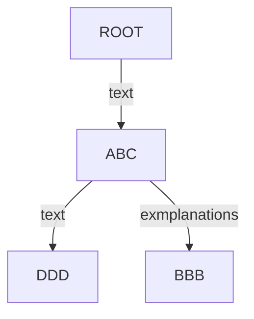

[//]: # (This is sample page #1 REPLACE_ME: Replace or remove according to your needs)
### Paragraph #1 

#### Mermaid diagram
Sample diagram using [mermaid](https://mermaid.js.org/) syntax:

#### PlantUML diagram
Sample diagram using [PlantUML](https://plantuml.com/) syntax.

Generated from `input/images-source/sample.plantuml` file:

